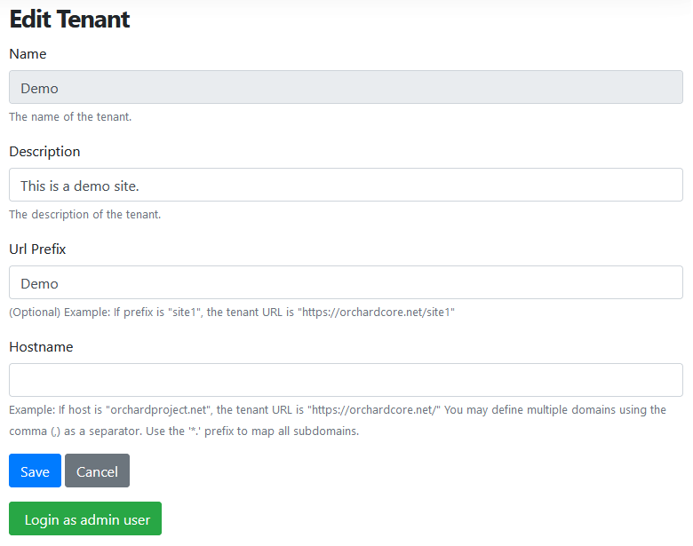

# Lombiq Hosting - Tenants Admin Login for Orchard Core


[](https://www.nuget.org/packages/Lombiq.Hosting.Tenants.Admin.Login/)


## About

With the help of this module, you can log in from the Default tenant's admin dashboard to any other tenants as an administrator user. This is useful if you manage a lot of customer tenants and don't want to create individual logins of yours for each of them.


## Documentation

This module contains two features:
- `Lombiq.Hosting.Tenants.Admin.Login`
- `Lombiq.Hosting.Tenants.Admin.Login.SubTenant`


### `Lombiq.Hosting.Tenants.Admin.Login`

This feature is only available on the Default tenant. It provides a button on the tenant editor page. After clicking this button, you'll be logged to the selected tenant as an administrator and be redirected to its admin dashboard.



**NOTE:**  Login will not be successful if the tenant has no user with the administrator role.

The feature also provides a `LoginAsAdmin` permission. Only users who have this permission can see the login button (by default users possessing the Administrator role).


### `Lombiq.Hosting.Tenants.Admin.Login.SubTenant`

This feature provides a controller which can authenticate the request from the Default tenant as an administrator user. From the Default tenant, you can log in to only those tenants that have this feature enabled.


## How to enable the Sub-tenant feature on every tenant

In the web project's Startup class in the following way, you can enable `Lombiq.Hosting.Tenants.Admin.Login.SubTenant` feature on all tenants.

```csharp
public void ConfigureServices(IServiceCollection services) =>
    services.AddOrchardCms(
        builder => builder.AddTenantFeatures(Lombiq.Hosting.Tenants.Admin.Login.Constants.FeatureNames.SubTenant));
```

**NOTE:**  This way the feature will also be enabled on the Default tenant. Therefore, for greater security, the controller does not perform anything on the Default tenant.


## Dependencies 

This module has the following dependencies:

- [Lombiq Helpful Libraries for Orchard Core](https://github.com/Lombiq/Helpful-Libraries)
